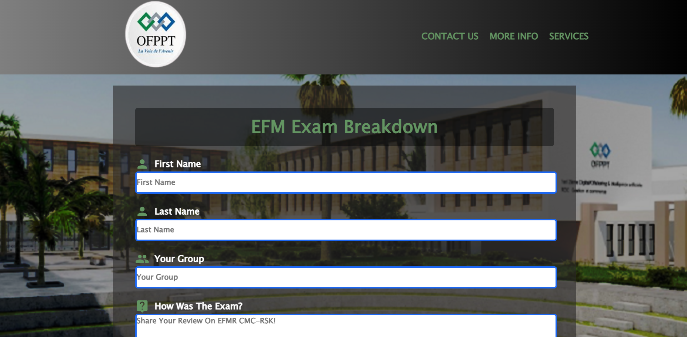

# 📌 Exam Feedback System

This is a simple **PHP & MySQL project** that allows students to submit feedback about their exams.  
It collects information such as **first name, last name, group, exam review, and improvement suggestions**.  
The feedback is stored in a MySQL database for later review.

---

## 🚀 Features
- Collect student information (first name, last name, group).
- Students can share their **exam experience** and **feedback for improvement**.
- Data is securely stored in a **MySQL database**.
- Basic input sanitization using PHP filters.
- Simple and clean UI with HTML & CSS.

---

## 🛠️ Technologies Used
- **PHP** (for backend logic)
- **MySQLi** (for database connection & queries)
- **MySQL** (for database storage)
- **HTML5 & CSS3** (for frontend)
- **Google Material Icons** (for icons)


---
## 📂 Project Image 


---

## 📂 Project Structure

---

## ⚙️ Setup Instructions

1. Clone the repository:
   ```bash
   git clone https://github.com/your-username/examFeedback.git
